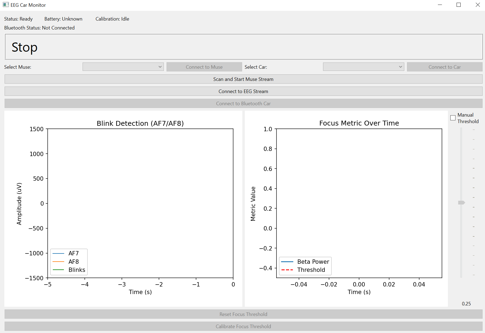

# NeuroToys EEG Car Control - Technical Documentation

This document provides a comprehensive technical overview of the NeuroToys EEG Car Control software, detailing its modules, the car's firmware, dependencies, setup, and installation.

## 1. Software Modules Overview

The project consists of several Python modules working together to read EEG data, detect user intent (blinks and focus), and control a Bluetooth-enabled car, alongside the embedded firmware running on the ESP32 car itself. These modules are primarily organized into [`muse`](muse/) and [`Bluetooth/bluetooth_setup`](Bluetooth/bluetooth_setup/) subdirectories, while the car firmware is in [`Bluetooth/bluetooth_ino`](Bluetooth/bluetooth_ino/) and [`Bluetooth/gatt_server`](Bluetooth/gatt_server/).

*   **[`new_gui.py`](muse/new_gui.py) (in `muse`)**:
    *   **Purpose**: The main application entry point and graphical user interface (GUI).
    *   **Functionality**:
        *   Provides the user interface built with PyQt6 for interacting with the system 
        *   Manages the overall workflow: scanning for Muse devices, connecting to Muse, starting the LSL stream, connecting to EEG detectors, scanning/selecting/connecting to the Bluetooth car, and handling focus calibration.
        *   Coordinates background threads:
            *   `BluetoothThread`: Manages BLE scanning, connection, and communication with the car using [`BluetoothController`](Bluetooth/bluetooth_setup/bluetooth.py) (from [`Bluetooth/bluetooth_setup/bluetooth.py`](Bluetooth/bluetooth_setup/bluetooth.py)), `bleak`, and `asyncio`. Handles device selection via a dropdown.
            *   `BatteryCheckThread`: Briefly connects to Muse to get battery level using `muselsl.muse.Muse`.
            *   `run_stream_in_thread`: Starts the `muselsl` LSL stream for EEG data in a standard `threading.Thread`.
            *   [`BlinkDetector`](muse/blink_detection.py) & [`FocusDetector`](muse/focus_detection.py): Run in separate QThreads for real-time EEG signal processing.
        *   Displays real-time status updates (EEG, Battery, Calibration, Bluetooth), EEG plots (filtered channel data, blink markers, focus metric, threshold), and car movement status.
        *   Handles user inputs: button clicks, dropdown selections (Muse, Car), slider/checkbox for manual focus threshold control.
        *   Sends movement commands ("MOVE_FORWARD", "STOP", "MOVE_LEFT", "MOVE_RIGHT") to the Bluetooth car based on signals from detectors, while blocking commands during calibration. Includes logic to maintain car state after turns.

*   **[`blink_detection.py`](muse/blink_detection.py) (in `muse`, `BlinkDetector` class)**:
    *   **Purpose**: Detects intentional eye blinks from specific EEG channels (AF7 for left, AF8 for right).
    *   **Functionality**:
        *   Connects to the Muse EEG LSL stream (`pylsl`).
        *   Buffers incoming EEG data (`numpy`).
        *   Applies filtering (Butterworth bandpass 0.5-5 Hz) to isolate low-frequency signals associated with corneoretinal motion.
        *   Uses peak detection (`scipy.signal.find_peaks`) on filtered data to identify characteristic positive spike followed by negative spike patterns.
        *   Distinguishes left (AF7) vs. right (AF8) blinks based on which channel the pattern occurs on and which channels are found in the LSL stream.
        *   Implements a per-channel cooldown mechanism (`BLINK_COOLDOWN` from [`constants.py`](muse/constants.py)) to filter out rapid/involuntary blinks and avoid re-detecting the same blink.
        *   Emits signals (`PyQt6.QtCore.pyqtSignal`) to the GUI ([`new_gui.py`](muse/new_gui.py)) for detected blinks and plot data.

*   **[`focus_detection.py`](muse/focus_detection.py) (in `muse`, `FocusDetector` class)**:
    *   **Purpose**: Estimates user focus level based on EEG Beta band power analysis.
    *   **Functionality**:
        *   Connects to the Muse EEG LSL stream (`pylsl`).
        *   Buffers incoming EEG data (`numpy`).
        *   Applies notch filtering (60Hz) with [`utils.update_buffer`](muse/utils.py).
        *   Epochs the data and calculates band powers (Delta, Theta, Alpha, Beta) using FFT with [`utils.compute_band_powers`](muse/utils.py). Uses a buffer (`band_buffer`) to smooth band power estimates.
        *   Calculates a 'focus metric' based on smoothed, inverted Beta power.
        *   Compares the metric against a threshold (auto-calculated from history or manually set) to determine the focus state.
        *   Includes methods for managing the manual and automatic threshold.
        *   Emits signals (`PyQt6.QtCore.pyqtSignal`) to the GUI ([`new_gui.py`](muse/new_gui.py)) for focus state changes and plot data.

*   **[`constants.py`](muse/constants.py) (in `muse`)**:
    *   **Purpose**: Centralized storage for configuration parameters and constants.
    *   **Functionality**: Defines static values used across different modules, such as Muse properties, LSL timeouts, buffer lengths, epoch/overlap settings, and parameters for blink/focus detection thresholds.

*   **[`utils.py`](muse/utils.py) (in `muse`)**:
    *   **Purpose**: Provides utility functions for common EEG signal processing tasks.
    *   **Functionality**: Includes functions for:
        *   [`epoch()`](muse/utils.py): Dividing continuous data into windows.
        *   [`compute_band_powers()`](muse/utils.py): Calculating power spectral density and band powers using FFT.
        *   [`update_buffer()`](muse/utils.py): Managing rolling data buffers, optionally applying 60Hz notch filtering.
        *   [`get_last_data()`](muse/utils.py): Extracting the most recent data from a buffer.
        *   [`nextpow2()`](muse/utils.py): Helper for FFT length calculation.

*   **[`Bluetooth/bluetooth_setup/bluetooth.py`](Bluetooth/bluetooth_setup/bluetooth.py) (`BluetoothController` class)**:
    *   **Purpose**: Handles low-level Bluetooth Low Energy (BLE) communication with the target device (ESP32 car).
    *   **Functionality**:
        *   Uses the `bleak` library for asynchronous BLE interactions (`asyncio`).
        *   [`scan_for_device(name_pattern)`](Bluetooth/bluetooth_setup/bluetooth.py): Scans for nearby BLE devices matching a name pattern (e.g., "ESP_CAR*", "ESP_CAR"). Can return a list of devices if `*` is used.
        *   [`scan_all_devices()`](Bluetooth/bluetooth_setup/bluetooth.py): Scans and lists all available BLE devices.
        *   [`connect(name)`](Bluetooth/bluetooth_setup/bluetooth.py): Attempts to connect by scanning for a specific name (less flexible).
        *   [`connect_to_device(device_object)`](Bluetooth/bluetooth_setup/bluetooth.py): Establishes a connection to a specific `bleak` device object obtained from a scan.
        *   [`list_services()`](Bluetooth/bluetooth_setup/bluetooth.py): Prints the GATT services and characteristics of the connected device.
        *   [`subscribe_to_notifications(characteristic_uuid)`](Bluetooth/bluetooth_setup/bluetooth.py): Subscribes to notifications from a specified characteristic, calling a registered callback (`handle_notification` or custom).
        *   [`send_command(command_string)`](Bluetooth/bluetooth_setup/bluetooth.py): Sends string commands ("MOVE_FORWARD", "STOP", "MOVE_LEFT", "MOVE_RIGHT") as bytes to a predefined `CHARACTERISTIC_UUID` (specifically `0000ff01-0000-1000-8000-00805f9b34fb`).
        *   [`disconnect()`](Bluetooth/bluetooth_setup/bluetooth.py): Disconnects from the BLE device.
        *   [`is_connected()`](Bluetooth/bluetooth_setup/bluetooth.py): Attempts to verify the active connection status.
        *   [`set_notification_callback()`](Bluetooth/bluetooth_setup/bluetooth.py): Allows registering an external function to process incoming BLE notifications.
        *   Manages the internal connection state (`self.connected`).

*   **[`Bluetooth/bluetooth_setup/connect.py`](Bluetooth/bluetooth_setup/connect.py)**:
    *   **Purpose**: Provides a TCP server interface to control the Bluetooth car (primarily for testing/demonstration).
    *   **Functionality**: Runs an `asyncio` loop that maintains a connection to the Bluetooth car via [`BluetoothController`](Bluetooth/bluetooth_setup/bluetooth.py) and listens for commands on a TCP socket (`127.0.0.1:8888`). Received commands are sent to the car using the `BluetoothController.send_command` method.

*   **[`Bluetooth/bluetooth_setup/example.py`](Bluetooth/bluetooth_setup/example.py)**:
    *   **Purpose**: A simple example script demonstrating basic [`BluetoothController`](Bluetooth/bluetooth_setup/bluetooth.py) usage (primarily for testing/demonstration).
    *   **Functionality**: Scans for the default "ESP_CAR" device, connects, lists services, subscribes to notifications, sends example commands ("MOVE_FORWARD", "STOP"), and then disconnects.

*   **[`Bluetooth/bluetooth_setup/input.py`](Bluetooth/bluetooth_setup/input.py)**:
    *   **Purpose**: A command-line interface for sending commands to the Bluetooth car (primarily for testing/demonstration).
    *   **Functionality**: Scans for the default "ESP_CAR" device, connects via [`BluetoothController`](Bluetooth/bluetooth_setup/bluetooth.py), subscribes to notifications, and then enters a loop prompting the user for input commands. Sends the input using `BluetoothController.send_command`. Disconnects on 'exit' or KeyboardInterrupt.

*   **[`Bluetooth/bluetooth_setup/send.py`](Bluetooth/bluetooth_setup/send.py)**:
    *   **Purpose**: A command-line utility to send a single command to the [`connect.py`](Bluetooth/bluetooth_setup/connect.py) TCP server (primarily for testing/demonstration).
    *   **Functionality**: Takes a command as a command-line argument, connects to the TCP server running [`connect.py`](Bluetooth/bluetooth_setup/connect.py), sends the command, and immediately disconnects. Requires [`connect.py`](Bluetooth/bluetooth_setup/connect.py) to be running.

*   **[`Bluetooth/bluetooth_ino/bluetooth.ino`](Bluetooth/bluetooth_ino/bluetooth.ino)**:
    *   **Purpose**: Arduino sketch firmware for the ESP32 car, implementing the BLE GATT server.
    *   **Functionality**:
        *   Initializes GPIO pins for motor control (`in1`, `in2`, `in3`, `in4`) and a reverse LED (`rev_LED`).
        *   Sets up the ESP32 as a BLE device with the name "ESP_CAR".
        *   Creates a BLE GATT server with `SERVICE_UUID = "000000ff-0000-1000-8000-00805f9b34fb"`.
        *   Adds a characteristic with `CHARACTERISTIC_UUID = "0000ff01-0000-1000-8000-00805f9b34fb"` that supports READ, WRITE, and NOTIFY properties.
        *   Defines callback functions (`MyServerCallbacks`, `MyCallbacks`) to handle BLE events (connect, disconnect, write).
        *   The `onWrite` callback receives incoming string commands ("MOVE_FORWARD", "STOP", "MOVE_LEFT", "MOVE_RIGHT", "MOVE_REVERSE", "REVERSE_LED_ON", "REVERSE_LED_OFF") written to the characteristic and calls corresponding motor/LED control functions.
        *   Includes basic motor control functions (`Forward`, `Reverse`, `Left`, `Right`, `Stop`) and LED control functions (`Reverse_LED_ON`, `Reverse_LED_OFF`).
        *   Starts BLE advertising to make the device discoverable.
        *   Includes a startup sequence to briefly test motor functions.

*   **[`Bluetooth/gatt_server/main/gatts_demo.c`](Bluetooth/gatt_server/main/gatts_demo.c)**:
    *   **Purpose**: ESP-IDF C firmware for the ESP32 car, implementing a more complex BLE GATT server based on Espressif examples.
    *   **Functionality**:
        *   Configures and initializes the ESP32's Bluetooth controller and Bluedroid stack.
        *   Initializes GPIO pins for motor control (`in1`, `in2`, `in3`, `in4`) and a reverse LED (`rev_LED`).
        *   Sets the BLE device name to "ESP_CAR".
        *   Registers GATT server callbacks (`gatts_event_handler`) to handle various BLE events.
        *   Sets up two GATT profiles (PROFILE_A, PROFILE_B), although PROFILE_A is the primary one used for car control.
        *   PROFILE_A creates a service (`SERVICE_UUID = "000000ff-0000-1000-8000-00805f9b34fb"`) and a characteristic (`CHARACTERISTIC_UUID = "0000ff01-0000-1000-8000-00805f9b34fb"`) with READ, WRITE, and NOTIFY properties, similar to the Arduino sketch.
        *   The `ESP_GATTS_WRITE_EVT` handler processes incoming write operations on the characteristic. It extracts the string command and calls the appropriate motor/LED control functions (`Forward`, `Reverse`, `Left`, `Right`, `Stop`, `Reverse_LED_ON`, `Reverse_LED_OFF`).
        *   Manages advertising data and parameters.
        *   Includes basic motor control functions using `gpio_set_level`.
        *   Includes a startup sequence to briefly test motor functions.

*   **[`muse/old_code`](muse/old_code/)**:
    *   **Purpose**: Contains older versions or experimental scripts related to EEG processing and plotting.
    *   **Functionality**: These files ([`blink_plot.py`](muse/old_code/blink_plot.py), [`focus_plot.py`](muse/old_code/focus_plot.py), [`main_gui.py`](muse/old_code/main_gui.py), [`signals.py`](muse/old_code/signals.py)) represent previous implementations or testing components and are kept for historical reasons. The `seaborn` library, listed as a dependency, is used within these older plotting files.

## 2. Dependency Flowchart

```mermaid
graph TD
    subgraph "User Interface & Control"
        GUI[new_gui.py]
    end

    subgraph "EEG Processing"
        Blink[blink_detection.py]
        Focus[focus_detection.py]
        Utils[utils.py]
        Const[constants.py]
    end

    subgraph "Hardware Interaction"
        BT_Ctrl["BluetoothController<br>(bluetooth.py)"]
        MuseLSL["muselsl library"]
        MuseClass["muselsl.muse.Muse class"]
        ESP32_FW["ESP32 Firmware<br>(bluetooth.ino / gatts_demo.c)"]
    end

    subgraph "Bluetooth Examples/Tools"
        ConnectBT[connect.py]
        ExampleBT[example.py]
        InputBT[input.py]
        SendBT[send.py]
    end

    subgraph "Old Code (Historical)"
        OldBlinkPlot[blink_plot.py]
        OldFocusPlot[focus_plot.py]
        OldGUI[main_gui.py]
        OldSignals[signals.py]
    end


    subgraph "Core Libraries"
        PyQt6["PyQt6"]
        Numpy["numpy"]
        Scipy["scipy"]
        Matplotlib["matplotlib"]
        Asyncio["asyncio (Python Std Lib)"]
        Threading["threading (Python Std Lib)"]
        Bleak["bleak"]
        Pylsl["pylsl"]
        Sklearn["scikit-learn"]
        Qasync["qasync"]
        Seaborn["seaborn"]
    end

    %% GUI Dependencies
    GUI --> Blink
    GUI --> Focus
    GUI --> Const
    GUI --> BT_Ctrl
    GUI --> MuseLSL
    GUI --> MuseClass
    GUI --> PyQt6
    GUI --> Matplotlib
    GUI --> Numpy
    GUI --> Asyncio
    GUI --> Threading
    GUI --> Qasync

    %% Detector Dependencies
    Blink --> Const
    Blink --> Utils
    Blink --> Pylsl
    Blink --> Numpy
    Blink --> Scipy
    %% For signals
    Blink --> PyQt6

    Focus --> Const
    Focus --> Utils
    Focus --> Pylsl
    Focus --> Numpy
    Focus --> Scipy
    %% For signals
    Focus --> PyQt6

    %% Utility Dependencies
    Utils --> Numpy
    Utils --> Scipy
    %% Imported but not explicitly used in provided code
    Utils --> Sklearn

    %% Hardware Abstraction Dependencies
    %% Uses stream() and list_muses()
    GUI --> MuseLSL
    %% Uses Muse() for battery check
    GUI --> MuseClass
    %% Connects to LSL stream
    Blink --> Pylsl
    %% Connects to LSL stream
    Focus --> Pylsl
    BT_Ctrl --> Bleak
    BT_Ctrl --> Asyncio
    %% Internal dependency of muselsl backend
    MuseLSL --> Bleak
    %% Python controls ESP32 Firmware via BLE
    BT_Ctrl --> ESP32_FW

    %% Threads coordinated by GUI
    GUI -- "BluetoothThread" --> BT_Ctrl
    GUI -- "BluetoothThread" --> Asyncio
    %% For signals
    GUI -- "BluetoothThread" --> PyQt6

    GUI -- "BatteryCheckThread" --> MuseClass
    GUI -- "BatteryCheckThread" --> Asyncio
    %% Standard thread
    GUI -- "BatteryCheckThread" --> Threading
    %% For signals
    GUI -- "BatteryCheckThread" --> PyQt6

    GUI -- "LSL Stream Thread" --> MuseLSL
    GUI -- "LSL Stream Thread" --> Asyncio
    %% Standard thread
    GUI -- "LSL Stream Thread" --> Threading

    GUI -- "BlinkDetector Thread" --> Blink
    %% QThread management
    GUI --> PyQt6

    GUI -- "FocusDetector Thread" --> Focus
    %% QThread management
    GUI --> PyQt6

    %% Bluetooth Examples/Tools Dependencies
    ConnectBT --> BT_Ctrl
    ConnectBT --> Asyncio
    ExampleBT --> BT_Ctrl
    ExampleBT --> Asyncio
    InputBT --> BT_Ctrl
    InputBT --> Asyncio
    SendBT --> Asyncio
    %% Uses asyncio.open_connection

    %% SendBT depends on ConnectBT running
    SendBT -- "sends commands to" --> ConnectBT

    %% Old Code Dependencies (Historical)
    OldBlinkPlot --> Seaborn
    OldFocusPlot --> Seaborn
    OldGUI --> OldBlinkPlot
    OldGUI --> OldFocusPlot
    OldGUI --> OldSignals
    OldGUI --> Const 

    %% Plotting Library Dependencies
    GUI --> Matplotlib
    %% Matplotlib backend uses numpy
    GUI --> Numpy

```



## 3. Development & Build Environment

This project is developed primarily in Python and relies on several external libraries. The ESP32 car requires separate firmware development and flashing tools.

*   **Operating System**: Windows 10/11, macOS. The Python software was tested working on both operating systems.
*   **Programming Language**: Python (>= 3.8 recommended, tested with 3.12.7).
*   **Key Python Libraries**: Based on the provided [`requirements.txt`](requirements.txt) file.
    *   `bleak==0.22.3`: Cross-platform Bluetooth Low Energy client. Used by [`BluetoothController`](Bluetooth/bluetooth_setup/bluetooth.py) for all BLE interactions.
    *   `matplotlib==3.10.1`: For plotting EEG data and focus metrics in the GUI ([`new_gui.py`](muse/new_gui.py)).
    *   `muselsl==2.3.1`: For interfacing with Muse headsets (streaming, battery check).
    *   `numpy==2.2.4`: For numerical operations (signal processing, data buffering, plotting).
    *   `pylsl==1.17.6`: For receiving data streams via LabStreamingLayer from `muselsl`.
    *   `PyQt6==6.9.0`: For the graphical user interface ([`new_gui.py`](muse/new_gui.py)).
    *   `PyQt6_sip==13.10.0`: PyQt6 support library.
    *   `qasync==0.27.1`: Allows integrating `asyncio` event loops with PyQt's event loop ([`new_gui.py`](muse/new_gui.py)).
    *   `scikit_learn==1.6.1`: Machine learning library (imported in [`utils.py`](muse/utils.py), although core classification logic in `muse` directory uses simpler methods).
    *   `scipy==1.15.2`: For signal processing functions (filters, peak detection, FFT helpers) used by [`blink_detection.py`](muse/blink_detection.py) and [`focus_detection.py`](muse/focus_detection.py).
    *   `seaborn==0.13.2`: Data visualization library. Primarily used in the historical plotting scripts located in [`muse/old_code`](muse/old_code/).
*   **ESP32 Firmware Development**:
    *   Platform: ESP32 microcontroller. Refer to [`README_HARDWARE.md`](README_HARDWARE.md) for specifics on the hardware used.
    *   Development Framework: Either Arduino IDE with ESP32 boards support or ESP-IDF (Espressif IoT Development Framework).
    *   Files: [`Bluetooth/bluetooth_ino/bluetooth.ino`](Bluetooth/bluetooth_ino/bluetooth.ino) (Arduino) or [`Bluetooth/gatt_server/main/gatts_demo.c`](Bluetooth/gatt_server/main/gatts_demo.c) (ESP-IDF). Choose one to flash to the ESP32.
*   **Build System**: N/A for the Python application (runs directly from source). Requires Arduino IDE or ESP-IDF build tools for compiling and flashing the ESP32 firmware.
*   **Deployment**: N/A for the Python application (Run directly from source). Requires flashing the compiled firmware onto the ESP32 car.

## 4. Installation Guide (From Scratch)

These steps guide you through setting up the Python environment and installing the necessary libraries. Setting up and flashing the ESP32 firmware requires separate steps not explained here. Refer to [`README_HARDWARE.md`](README_HARDWARE.md) for hardware information.

1.  **Install Python**:
    *   Download and install Python (>= 3.8 recommended, Tested with 3.12.7) from [python.org](https://www.python.org/).
    *   Ensure Python and `pip` are added to your system's PATH during installation. Verify by opening Command Prompt/Terminal and typing `python --version` and `pip --version`.

2.  **Get the Source Code**:
    *   Clone the repository using Git:
        ```bash
        git clone https://github.com/Mete4/NeuroToys.git
        cd NeuroToys
        ```
    *   Alternatively, download the source code as a ZIP file from the GitHub page and extract it. Navigate into the main project directory (`NeuroToys`).

3.  **Install Python Dependencies**:
    *   Open Command Prompt or Terminal **in the main project directory** (the root folder containing [`requirements.txt`](requirements.txt)).
    *   Install the required Python libraries using pip and the [`requirements.txt`](requirements.txt) file:
        ```bash
        pip install -r requirements.txt
        ```
    *   This command installs all the specific versions listed in Section 3.

4.  **Bluetooth Setup (Host PC)**:
    *   Ensure your computer (Windows 10/11 or macOS) has Bluetooth enabled and the necessary drivers installed. `bleak` generally works with the built-in Bluetooth stack.

5.  **ESP32 Car Firmware Setup**:
    *   This project requires compatible firmware flashed onto the ESP32 microcontroller on the car. Refer to [`README_HARDWARE.md`](README_HARDWARE.md) for details on the hardware.
    *   Choose either the Arduino sketch ([`Bluetooth/bluetooth_ino/bluetooth.ino`](Bluetooth/bluetooth_ino/bluetooth.ino)) or the ESP-IDF code ([`Bluetooth/gatt_server/main/gatts_demo.c`](Bluetooth/gatt_server/main/gatts_demo.c)).
    *   Set up the appropriate development environment (Arduino IDE or ESP-IDF).
    *   Compile the chosen firmware.
    *   Flash the compiled firmware onto the ESP32 board on the car.
    *   *Detailed instructions for setting up Arduino IDE or ESP-IDF and flashing are outside the scope of this document but are necessary for the car hardware.*

6.  **Muse Headset**:
    *   Ensure your Muse 2 headset is charged and available.
    *   Power on the headset.

7.  **Running the Application**:
    *   Refer to the "Usage" section in the **NeuroToys User Manual** ([`documents/UserManual.pdf`](documents/UserManual.pdf)) for detailed instructions on preparing hardware and launching the main GUI application ([`new_gui.py`](muse/new_gui.py)).
    *   The main application script [`new_gui.py`](muse/new_gui.py) is located in the [`muse`](muse/) subdirectory. From the main project directory, you would typically run it by navigating to the [`muse`](muse/) and running it like:
        ```bash
        cd muse
        python new_gui.py
        ```

## 5. Usage

Refer to the **NeuroToys User Manual** ([`documents/UserManual.pdf`](documents/UserManual.pdf)) for detailed instructions on how to prepare the hardware (car, headset), set up the headset properly, launch the main GUI application ([`new_gui.py`](muse/new_gui.py)), connect to the Muse headset and LSL stream, connect to the Bluetooth car, calibrate the focus threshold, and control the car using blinks and focus.

The scripts in [`Bluetooth/bluetooth_setup`](Bluetooth/bluetooth_setup/) ([`connect.py`](Bluetooth/bluetooth_setup/connect.py), [`example.py`](Bluetooth/bluetooth_setup/example.py), [`input.py`](Bluetooth/bluetooth_setup/input.py), [`send.py`](Bluetooth/bluetooth_setup/send.py)) are primarily for testing and demonstration of the Bluetooth communication layer and are not part of the standard GUI application workflow described in the User Manual.

